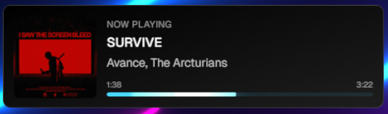

# Cyberus Spotify Now Playing Overlay

A sleek, glassmorphic Spotify "Now Playing" overlay for OBS and streaming, featuring a TRON Legacy-inspired electric blue aesthetic with smooth animations.



## 🚀 Quick Start Guide

### Step 1: Install Required Software
1. Download and install [Node.js](https://nodejs.org/) (LTS version)
2. Download and install [Git](https://git-scm.com/downloads)
3. Download and install [Visual Studio Code](https://code.visualstudio.com/) (recommended editor)

### Step 2: Get the Project
1. Open Terminal (Command Prompt on Windows)
2. Copy and paste these commands one by one:
   ```bash
   git clone https://github.com/yourusername/cyberus.git
   cd cyberus
   npm install
   ```

### Step 3: Set Up Spotify
1. Go to [Spotify Developer Dashboard](https://developer.spotify.com/dashboard)
2. Log in with your Spotify account
3. Click "Create App"
4. Fill in the form:
   - App name: Choose any name (e.g., "Cyberus Overlay")
   - Description: Anything you want
   - Redirect URI: `http://localhost:3000/api/spotify/callback`
   - Click "Save"
5. On your app's page, click "Settings"
6. Copy the "Client ID" and "Client Secret"

### Step 4: Configure the Project
1. In your project folder, create a file named `.env`
2. Add these lines to the file:
   ```env
   SPOTIFY_CLIENT_ID=your_client_id_here
   SPOTIFY_CLIENT_SECRET=your_client_secret_here
   ```
   Replace `your_client_id_here` and `your_client_secret_here` with the values from Step 3

### Step 5: Get Your Refresh Token
1. Open Terminal in your project folder
2. Run:
   ```bash
   npm run dev
   ```
3. Open your web browser and go to: `http://localhost:3000/api/spotify/auth`
4. Log in to Spotify if prompted
5. After authorizing, you'll see your refresh token
6. Copy the refresh token and add it to your `.env` file:
   ```env
   SPOTIFY_CLIENT_ID=your_client_id_here
   SPOTIFY_CLIENT_SECRET=your_client_secret_here
   SPOTIFY_REFRESH_TOKEN=your_refresh_token_here
   ```

### Step 6: Start the Overlay
1. Run these commands in Terminal:
   ```bash
   npm run build
   npm run start
   ```
2. Your overlay is now running at: `http://localhost:3000`

### Step 7: Add to OBS
1. In OBS, add a new "Browser" source
2. Set the URL to: `http://localhost:3000`
3. Set Width: 800 and Height: 200 (adjust as needed)
4. Check "Refresh browser when scene becomes active"

## 🎮 Using the Overlay
- The overlay automatically updates when:
  - A new song starts playing
  - The playback progress changes
  - Playback is paused or resumed
- Click the album art or song title to open the current track in Spotify

## 🔧 Troubleshooting
- If the overlay shows nothing:
  - Make sure Spotify is playing music
  - Check that all environment variables are set correctly
  - Try restarting the server (Stop with Ctrl+C, then `npm run start`)
- If you need a new refresh token:
  - Visit `http://localhost:3000/api/spotify/auth` again
  - Update the `.env` file with the new token

## 🆘 Need Help?
Create an issue on GitHub or reach out to the community for support!

## Features

- 🎵 Real-time Spotify playback display
- 🌟 Glassmorphic UI with TRON-inspired design
- ⚡ Smooth, animated progress bar with electric blue pulse
- 🖼️ Album artwork with hover effects
- 🔗 Direct links to songs on Spotify
- 🎮 OBS-ready transparent background

## Tech Stack

- **Framework**: Next.js 15 with App Router
- **Styling**: Tailwind CSS
- **Animations**: Framer Motion
- **Language**: TypeScript
- **API**: Spotify Web API

## Development

```bash
# Start development server
npm run dev

# Build for production
npm run build

# Start production server
npm run start

# Run linting
npm run lint
```

## Contributing

1. Fork the repository
2. Create your feature branch (`git checkout -b feature/amazing-feature`)
3. Commit your changes (`git commit -m 'Add some amazing feature'`)
4. Push to the branch (`git push origin feature/amazing-feature`)
5. Open a Pull Request

## License

This project is licensed under the MIT License - see the [LICENSE](LICENSE) file for details.

## Acknowledgments

- Design inspired by TRON Legacy
- Built with Next.js and Framer Motion
- Powered by Spotify Web API
